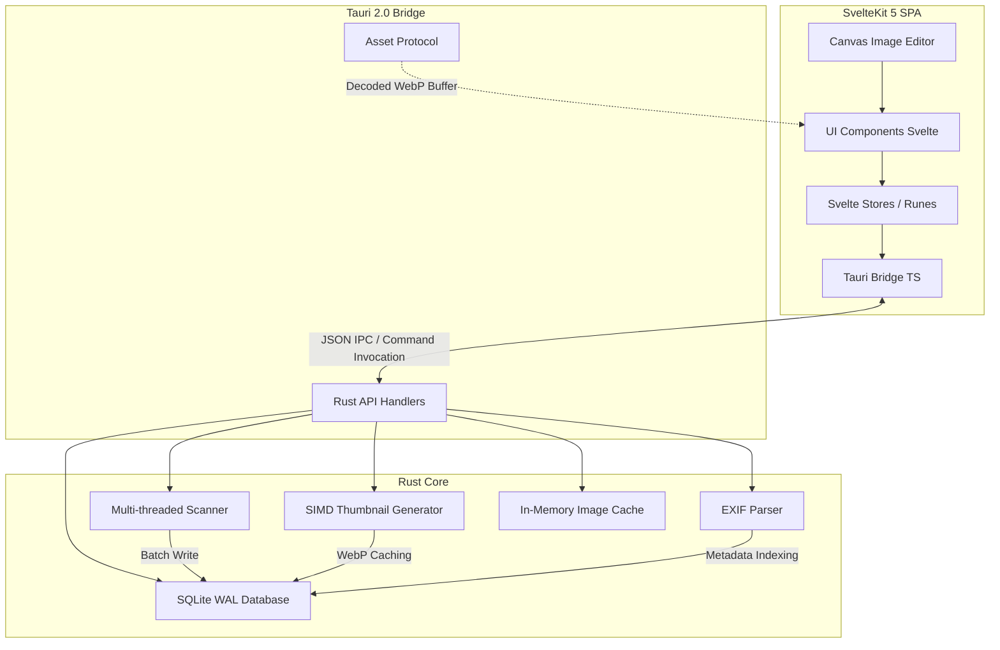

# Technical Architecture

Keepix is engineered as a hybrid desktop application combining a web-based, hardware-accelerated user interface with a high-performance system-level backend. 

---

## 🎨 Frontend Stack

### SvelteKit 5 & Svelte Runes
The Keepix user interface is built on SvelteKit 5, configured in Single Page Application (SPA) mode (`@sveltejs/adapter-static` with pre-rendering). 
- **Reactive Engine**: Utilizes Svelte 5 Runes (`$state`, `$derived`, `$effect`) for fine-grained reactivity. Unlike virtual DOM frameworks, Svelte compile-time reactivity updates only the specific elements modified, keeping CPU cycles free for image manipulation.
- **Virtualized Media Grid**: Handles thousands of items by rendering only the visible viewport elements. This technique prevents DOM bloat and keeps memory usage flat regardless of catalog size (tested up to 50,000 files).
- **Glassmorphic Theme**: A custom design system built with CSS custom properties (variables), backdrop filters, dynamic gradients, and CSS grid layouts. It adapts to light/dark modes and user scaling instantly.

---

## 🦀 Backend Core (Rust)

Tauri 2.0 acts as the secure, lightweight bridge between the Svelte frontend and the Rust backend. Rather than shipping a heavy Chromium runtime (like Electron), Tauri integrates the OS's native webview (WebView2 on Windows, WebKit on macOS), reducing bundle size from ~150MB down to ~15MB.

### 1. SQLite Database (`db.rs`)
To provide transactional integrity, undo history, and sub-millisecond metadata querying, Keepix bundles SQLite via the `rusqlite` crate.
- **Write-Ahead Logging (WAL)**: Enabled by default (`PRAGMA journal_mode=WAL;`). WAL allows concurrent readers to query the database while a writer modifies records, preventing UI freezes during heavy scanning operations.
- **Performance Adjustments**:
  - `PRAGMA synchronous = NORMAL;` to balance performance and safety.
  - `PRAGMA foreign_keys = ON;` to maintain cascade delete integrity.
- **Indexes**: Indices are configured on `project_id`, `category_id`, `file_path`, `file_hash`, and `star_rating` to guarantee constant-time $O(1)$ query speeds.

### 2. Multi-threaded File Discovery (`scanner.rs`)
When a directory is imported, Keepix scans it recursively:
- Uses a Rust thread pool via the `rayon` or thread-spawning crate.
- Skips hidden system directories (e.g., `$RECYCLE.BIN`, `.git`).
- Filters files based on supported MIME extensions:
  - **Photos**: `.jpg`, `.jpeg`, `.png`, `.webp`, `.tiff`, `.heic`
  - **Videos**: `.mp4`, `.mov`, `.mkv`
- Database writes are batched (processed in chunks of 500 records) inside a single SQLite transaction to maximize write IOPS.

### 3. SIMD-Accelerated Thumbnail Generator (`thumbnail.rs`)
Generating thumbnails for hundreds of RAW/high-resolution files can throttle CPUs. Keepix solves this via hardware acceleration:
- **`fast_image_resize`**: Uses Single Instruction, Multiple Data (SIMD) processor instructions (AVX2, SSE4.1, or NEON) to resize raw pixel arrays. This is up to **10x faster** than traditional CPU resampling.
- **Format**: Resized thumbnails are compressed into the WebP format at 80% quality, offering the optimal balance between visual clarity and file size.
- **Cache Registry**: Thumbnails are stored in a dedicated cache folder, with their paths mapped directly in SQLite, ensuring they are generated exactly once.

### 4. Metadata Pipeline (`metadata.rs`)
Keepix reads raw metadata directly from image binaries without loading the entire image into memory:
- **`kamadak-exif`**: A zero-copy EXIF parsing library that extracts exposure tags (aperture, ISO, exposure time, focal length, lens model, camera make, and orientation).
- **Payload**: The extracted EXIF tags are compiled into a lightweight JSON payload and stored in the database's `exif_json` column, making it instantly queryable by Svelte.

### 5. In-Memory Image Cache (`cache.rs`)
To prevent visual stutter when navigating images back-and-forth, Keepix implements a custom cache:
- Holds decoded image buffers in memory.
- Uses a background worker to **preload** the next 2 images in the current culling sequence.
- Includes auto-eviction constraints to keep memory footprint within safe boundaries.
